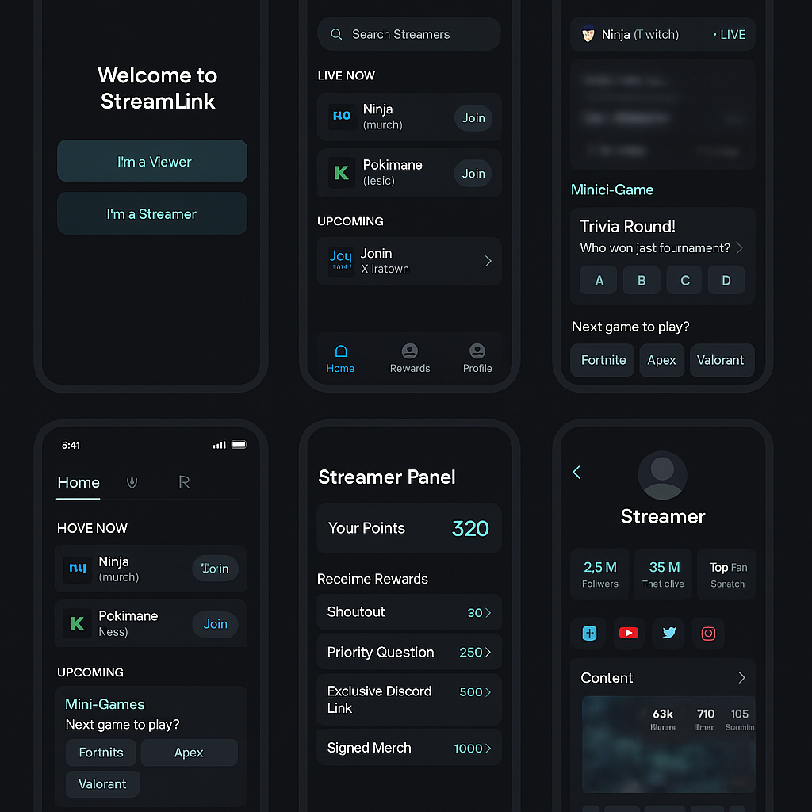

# StreamLink - L'application qui rapproche les streamers et leur audience

## Présentation Générale
StreamLink n’est pas une plateforme de streaming.  
C’est une **application compagnon universelle** qui agit comme un **pont entre les streamers et leurs spectateurs**.  
Son objectif est simple : rendre l’expérience de streaming et de visionnage plus **interactive, engageante et mémorable**.  

---

## Côté Streamers
StreamLink aide les streamers à aller plus loin que ce que proposent Twitch, YouTube ou Kick.  
Elle leur permet de :  
- **Centraliser** toutes leurs interactions, même s’ils streament sur plusieurs plateformes.  
- **Créer des interactions uniques** grâce à des sondages, mini-jeux, défis ou classements de spectateurs.  
- **Valoriser leur communauté** avec un système de points et de récompenses.  
- **Comprendre leurs fans** à travers des statistiques simples : qui sont les plus actifs, qui envoient le plus de cadeaux, à quels moments le chat est le plus vivant.  
- **Proposer des récompenses exclusives** (ex : shoutout en direct, accès à un groupe privé, coaching personnalisé, produits dérivés).  

Résultat : un streamer qui gagne en proximité, en visibilité et en fidélité de sa communauté.  

---

## Côté Spectateurs
Pour les spectateurs, StreamLink est **l’application compagnon ultime** :  
- **Un seul profil universel** pour suivre tous leurs streamers préférés, peu importe la plateforme.  
- **Des notifications intelligentes** dès qu’un streamer est en live, où qu’il soit.  
- **Un système de points** pour récompenser leur engagement (regarder, discuter, offrir, participer).  
- **Des interactions amusantes** : voter, jouer à des mini-jeux, lancer des défis aux streamers.  
- **Un espace de récompenses** où leurs points se transforment en avantages réels.  

Résultat : un spectateur qui ne se contente plus de regarder, mais qui **participe et influence l’expérience du live**.  

---

## Le Rôle de StreamLink (L’intermédiaire)
Là où les plateformes se limitent souvent à l’essentiel (chat, abonnements, dons), StreamLink vient combler les manques en offrant :  
- **Un profil unique** qui suit vos actions et récompenses sur plusieurs plateformes.  
- **Une communauté unifiée** où spectateurs et streamers de Twitch, YouTube et Kick peuvent interagir ensemble.  
- **Des clips et moments forts** générés automatiquement pour être partagés facilement.  
- **Un marketplace d’interactions** où les streamers proposent leurs propres offres spéciales (sessions privées, coaching, merch exclusif).  

---

## Flows et Wireframes

### Flow Spectateur (Viewer Flow)
1. **Onboarding** – Création d’un profil universel + choix des streamers favoris.  
2. **Accueil / Feed** – Voir qui est en live sur Twitch, Kick, YouTube.  
3. **Interaction en direct** – Chat, sondages, mini-jeux, défis.  
4. **Récompenses** – Dépenser ses points pour obtenir des avantages.  

#### Wireframe (texte)
```
Accueil Viewer
----------------------------
Rechercher un streamer

LIVE NOW
- Ninja (Twitch)   [Rejoindre]
- Pokimane (Kick)  [Rejoindre]

UPCOMING
- Shroud (YouTube) Live dans 2h

[ Nav: Accueil | Récompenses | Profil ]
----------------------------
```

```
Écran Live Interaction
----------------------------
Streamer: Ninja (Twitch) - LIVE
20k spectateurs

Chat en direct ici...

Mini-Jeu: "Trivia"
Q: Qui a gagné le dernier tournoi ?
[ A ] [ B ] [ C ] [ D ]

Sondage: Jeu suivant ?
[ Fortnite ] [ Apex ] [ Valorant ]

Points: 320
[ Utiliser mes points ]
----------------------------
```

---

### Flow Streamer (Streamer Flow)
1. **Connexion Dashboard** – Voir toutes les conversations et stats en temps réel.  
2. **Outils interactifs** – Créer sondages, mini-jeux, définir récompenses.  
3. **Marketplace des récompenses** – Mettre en avant des avantages exclusifs pour la communauté.  

#### Wireframe (texte)
```
Tableau de bord Streamer
----------------------------
Plateformes connectées:
Twitch
YouTube
Kick

Engagement en direct:
- Top Fan: User123 (1500)
- Spectateurs actifs: 20,350
- Sondages actifs: 2

Actions rapides:
[ + Nouveau sondage ]
[ + Lancer mini-jeu ]
[ + Définir récompenses ]
----------------------------
```

```
Marketplace Récompenses
----------------------------
Récompenses actuelles:
- Shoutout (100)
- Question Prioritaire (250)
- Lien Discord privé (500)

Ajouter une récompense :
[ Texte ] [ Points ] [ Sauvegarder ]
----------------------------
```

---

## Mockups Visuels
Un premier design en thème sombre moderne avec des accents de couleur vive a été réalisé.  



---

## Pourquoi StreamLink est indispensable
- Les **streamers** veulent plus d’engagement et de nouvelles sources de revenus.  
- Les **spectateurs** veulent être plus proches de leurs streamers préférés et se sentir reconnus.  
- Les **plateformes actuelles** sont limitées dans les interactions et la fidélisation.  

StreamLink devient donc **l’application compagnon incontournable** qui enrichit l’expérience du streaming, des deux côtés.  

---

## Vision
Notre ambition est de faire de StreamLink un **standard** dans le monde du streaming :  
- Un outil qui accompagne les spectateurs au quotidien.  
- Un partenaire incontournable pour les streamers qui veulent renforcer leur communauté.  
- Une expérience universelle qui dépasse les barrières de plateformes.  

Avec StreamLink, **regarder un live devient un vrai moment d’interaction, de jeu et de proximité**.  

---
